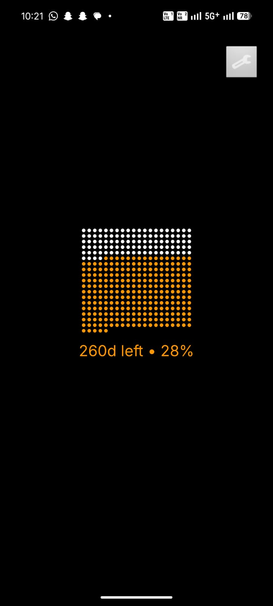
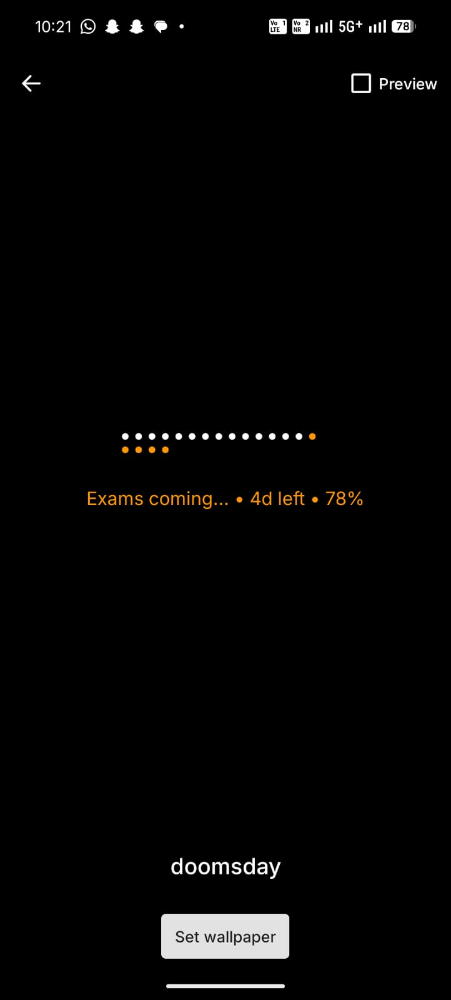
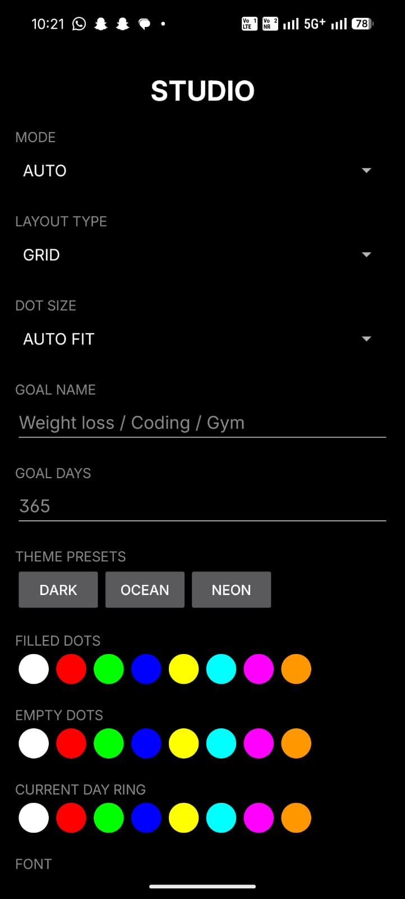

# ☠️ Doomsday — Live Wallpaper Countdown App

Premium Android live wallpaper countdown app built to visualize time, goals, and yearly progress using elegant dot-based layouts.

Designed and developed by Krishna (DevKrishna) 🚀

---

About
-----
Doomsday turns your lock screen into a minimal progress-visualization wallpaper. Every dot is meaningful: days in a year, days in a goal, or steps through a timeline. The current day is emphasized with a premium accent ring for a clean “time is running” aesthetic.

Modes:
- Year mode — each dot = a day in the year
- Goal mode — each dot = a day in your custom target
- Auto mode — smart default yearly countdown

Perfect for AMOLED screens — dark-first, elegant, battery-conscious.

Features
--------
- Live wallpaper support (WallpaperService)
- Filled / empty / current day color customization
- Adjustable dot size and spacing
- Multiple layout styles: Grid, Linear, Circle-ready foundation
- Font selector and date style selector
- Goal countdown with custom days and goal title
- Theme presets: Dark, Ocean, Neon
- First-time tutorial overlay
- Premium Studio settings panel for advanced customization
- Lock screen optimized design and smooth canvas drawing

Screenshots
-----------

Download
--------
Get the latest APK or install via Google Play when available.

- Download latest APK (GitHub Releases):  
  

Installation (APK)
------------------
1. Download the APK from Releases.
2. On your Android device either:
   - Install via adb: `adb install -r path/to/doomsday-live-wallpaper.apk`  
   - Or enable "Install unknown apps" for your installer and open the APK on the device.
3. Apply the wallpaper: long-press home → Wallpapers → Live Wallpapers → select "Doomsday" → Set wallpaper.
4. Open the app or Studio to configure colors, layout, goals, and fonts.

Quick start / App Flow
----------------------
1. Open app  
2. Tap ⚙️ Studio  
3. Choose mode (Year / Goal / Auto), colors, font, and layout  
4. Save settings  
5. Apply live wallpaper  
6. Enjoy daily progress on your lock screen

Customization
-------------
- Theme presets (Dark / Ocean / Neon) or create your own
- Colorize filled / empty / current-day rings
- Adjust dot size, spacing and layout type
- Add custom goal title and target days
- Font selector and date display options
- Add new theme JSON files into `assets/themes/` (follow examples)

Built with
----------
- Java
- Android SDK & WallpaperService API
- Custom Canvas drawing for efficient rendering
- SharedPreferences for settings
- Material-inspired custom UI components

Roadmap (Planned & Future Features)
----------------------------------
Planned by Krishna (DevKrishna):
- Midnight auto refresh engine
- Real-time live updates (per-minute)
- Wave / spiral / timeline layouts
- Gradient themes and animated transitions
- Glassmorphism UI cards and wallpaper preview editor
- Weekly / monthly modes, relationship & milestone countdowns
- Cloud backup for settings and advanced typography packs
- AI-based smart wallpaper suggestions

Developer
---------
Made with passion by Krishna (DevKrishna)  
GitHub: https://github.com/DevKrishna  
Project: Doomsday Live Wallpaper

Building from source
--------------------
Requirements:
- JDK 17
- Android SDK (matching project config)
- Android Studio (recommended) or Gradle wrapper

Steps:
1. Clone:
   git clone https://github.com/Smthbig/doomsday-live-wallpaper.git
2. Open in Android Studio or build on CLI:
   ./gradlew assembleRelease
3. Release APK: `app/build/outputs/apk/release/`

If you change module names or flavors, adapt the build path accordingly.

Permissions & Privacy
---------------------
Typical permissions:
- SET_WALLPAPER / SET_WALLPAPER_HINTS
- Optional: Storage (only when importing/saving assets)

No telemetry is collected by default. If you add analytics or crash reporting, disclose it and provide clear opt-out options.

Contributing
------------
Contributions welcome — please follow these steps:
1. Open an issue describing your idea or bug
2. Fork the repo, create a feature branch, add tests/screenshots
3. Submit a pull request with a clear description

Contribution guidelines:
- One logical change per PR
- Small, descriptive commits
- Include screenshots for UI changes

Support
-------
- Report bugs / request features: https://github.com/Smthbig/doomsday-live-wallpaper/issues
- For device-specific issues include: device model, Android version, and screen type (AMOLED/LCD)

License
-------
MIT License

Copyright (c) 2026 Krishna (DevKrishna)

Permission is hereby granted, free of charge, to any person obtaining a copy
of this software and associated documentation files (the "Software"), to deal
in the Software without restriction, including without limitation the rights
to use, copy, modify, merge, publish, distribute, sublicense, and/or sell
copies of the Software, and to permit persons to whom the Software is
furnished to do so, subject to the following conditions:

[Full MIT text continues here — include the standard MIT text in LICENSE file.]

FAQ
---
Q: Can I change fonts and colors?  
A: Yes — Studio contains a font selector and color controls. You can also add themes in assets.

Q: Is the wallpaper battery friendly?  
A: Yes — optimized for AMOLED and includes battery saving options (reduced animations / static mode).

Q: What Android versions are supported?  
A: Minimum supported Android level is set in the manifest. Test on your target devices and update SDK values if needed.

---

Thank you for checking out Doomsday. Make time visible — one dot at a time.
